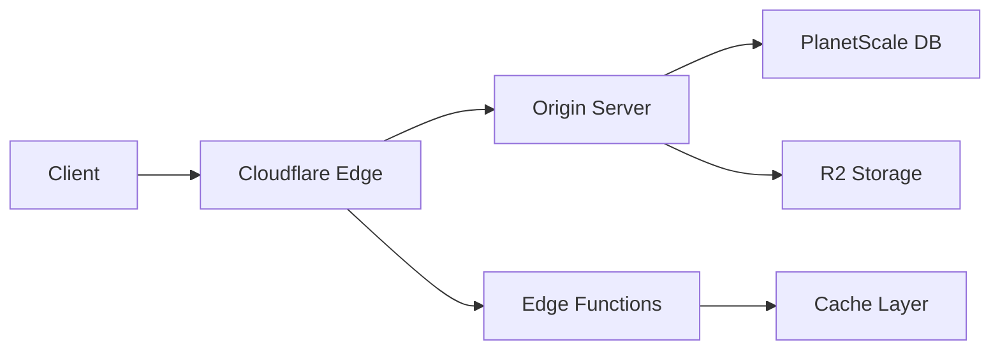

# EdgeSphere - Next-Gen Cloud Platform 🌐⚡


## 🚀 Introduction
EdgeSphere revolutionizes cloud computing by bringing powerful infrastructure to the edge. Our platform delivers unparalleled performance, security, and scalability for modern web applications.

**Live Demo:** [https://edgesphere.vercel.app](https://edgesphere.vercel.app)

[](https://vercel.com/new/git/external?repository-url=(https://github.com/shubham001official/Edge-Sphere))
[](https://github.com/shubham001official/Edge-Sphere)

## ✨ Key Features

### 🌍 Edge-Native Architecture
- Global low-latency distribution
- Intelligent request routing
- Automatic failover between regions

### 🛡️ Security First
- Zero-trust security model
- End-to-end encryption
- DDoS protection built-in

### ⚡ Performance Optimized
- Lightning-fast cold starts
- Smart caching strategies
- WASM-powered compute

### 🔧 Developer Experience
- Git-based deployments
- Real-time logs
- Performance analytics
- CLI integration

## 🖥️ Screenshots

|  |  |
|-------------------------------------------|-----------------------------------------------|
| *Modern Landing Page*                     | *Feature Highlights*                          |

|  |  |
|-------------------------------------------------|-------------------------------------------------------|
| *Sleek Authentication*                          | *Quick Onboarding*                                    |

|  |
|-----------------------------------------|
| *Powerful Management Console*           |

## 🛠️ Technology Stack

### Core Platform
- **Frontend**: Next.js 14 (App Router)
- **Styling**: Tailwind CSS + Framer Motion
- **Authentication**: NextAuth.js
- **Database**: PlanetScale (MySQL-compatible)
- **Storage**: R2 Cloudflare Storage

### Edge Infrastructure
- **Compute**: Cloudflare Workers
- **Networking**: Cloudflare Global Network
- **Security**: Cloudflare Zero Trust

### Development Tools
- **CI/CD**: GitHub Actions
- **Monitoring**: Sentry + Logflare
- **Testing**: Playwright + Vitest

## 🚀 Getting Started

### Prerequisites
- Node.js v18+
- pnpm 8.x
- Cloudflare account
- PlanetScale account

### Local Development
```bash
# Clone repository
git clone https://github.com/shubham001official/edgesphere.git
cd edgesphere

# Install dependencies
pnpm install

# Set up environment
cp .env.example .env.local
# Configure your environment variables

# Start development server
pnpm dev
```

## 🌐 Deployment

### One-Click Deploy
[](https://vercel.com/new/git/external?repository-url=[your-repo-url](https://github.com/shubham001official/Edge-Sphere))

### Manual Deployment
```bash
# Build production version
pnpm build

# Deploy to Vercel
vercel --prod
```

## 🏗️ Architecture



## 🤝 Contributing
We welcome contributions! Please see our [Contribution Guidelines](CONTRIBUTING.md) for details.

## 📜 License
MIT License - See [LICENSE](LICENSE) for details.

## 📬 Contact
- Email: [shubham001official@gmail.com](mailto:shubham001official@gmail.com)
- Twitter: [@S_Shubham001](https://twitter.com/S_Shubham001)

---

<p align="center">
  Made with ❤️ by Shubham Sharma | Powered by the Edge
</p>
